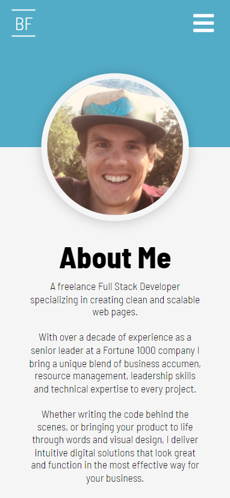

# portfolio-react

## Description
A fully responsive portfolio site written entirely in ReactJS and built to showcase React functionality as well as being a professional portfolio. Highlights the use of built-in and custom hooks and context to manage state and effect.

<strong>Table of Contents</strong>

- [Functionality Notes](#functionality-notes)
- [License](#license)
- [Languages Used](#languages-used)
- [Screenshots](#screenshots)
- [Questions and Links](#questions-and-links)
- [Details and Learnings](#details-and-learnings)

## Functionality Notes
The website is written as a Single Page Application (SPA) using React Router. As a result, I needed to handle redirecting 404 page errors caused by a hard page refresh of any sub pages in order to avoid the user hitting a 404 page. As the site is hosted entirely on the client side with no server, the Contact Me form directs to a mailto: link and fires the local email client. 

## License
© Tidy Lines LLC

## Languages Used
- JavaScript/CSS/HTML
- ReactJS
- Dependencies:
    - [create-react-app](https://create-react-app.dev/) complete initializer for ReactJS providing starter code, build dependencies and file structure
    - [gh-pages](https://www.npmjs.com/package/gh-pages) module to publish files to alternative branch on GitHub in order to host app as a client side SPA

## Screenshots
Screenshots of the application on desktop and mobile.

### Desktop

### Mobile

## Questions and Links
Please reach out with any questions regarding the application.

View the deployed application on [Heroku](https://benfok.github.io/portfolio-react/)

View the repository in [GitHub](https://github.com/benfok)

## Details and Learnings
- I designed the application to be fully responsive across devices. This can be tested by inspecting the site and changing the screen width. State needed to be managed at the global level in order to be maintained as mobile and desktop elements toggled.
- Created a custom hook useMedia to listen for and track screen widths in order to alter the navigation display (mobile vs desktop) as well as other responsive elements.
- Leveraged the global context to store the value of the current page so that state persisted regardless of whether the mobile or the desktop navigation element was triggered.
- As the application is written as a SPA I needed to add functionality to handle a hard refresh on a sub page to avoid hitting a 404 error in the browser. This involved adding a 404.html page to the build folder and a script to the index.html file to redirect back to the instance of the current page. Credit to [rafgraph](https://github.com/rafgraph/spa-github-pages) for this solution.
- The mobile nav menu initially caused some challenges on pages that were taller than 100vh. I solved this by disabling background scrolling when the mobile nav is open using useState.
- Future enhancements include:
    - Adding a Node.js backend to handle email sends and avoid the use of a mailto: link within the contact form
    - Adding Services section and expanding on Education and Experience
    - Adding a theme toggle to highlight additional functionality

 
